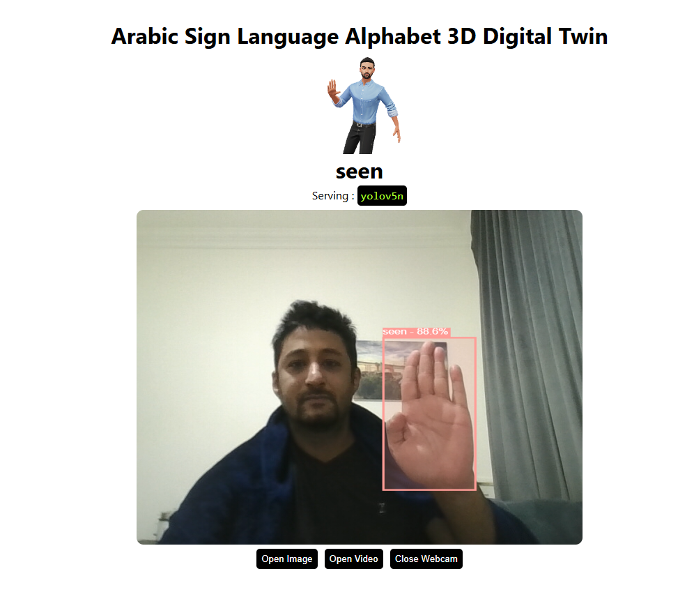

<p align="center">
  
</p>


---

Object Detection application right in your browser. Serving YOLOv5 in browser using tensorflow.js
with `webgl` backend.

**Setup**

```bash
git clone https://github.com/Hyuto/yolov5-tfjs.git
cd yolov5-tfjs
yarn install #Install dependencies
```

**Scripts**

```bash
yarn start # Start dev server
yarn build # Build for productions
```

## Model

[LINK](https://sketchfab.com/3d-models/3d-model-with-the-arabic-sign-language-alphabet-9e1274aa409a48818633c55ab209326d)


## Research Paper

[LINK](https://ieeexplore.ieee.org/abstract/document/10366491))

## Reference

https://github.com/Hyuto/yolov5-tfjs
https://github.com/ultralytics/yolov5
